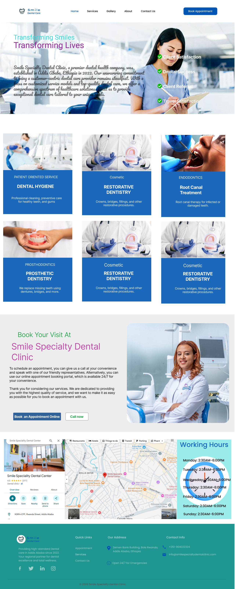

# FUTURE_UX_01
## 👉 See the Figma file:
[View Design](https://www.figma.com/design/0c3LIejO7HvxuwmDpNvWwL/smile-specility-dental-clinic?node-id=0-1&t=9qFvKFb1lOWrChKv-1)

## 🚀 Live Demo

# 🦷 Smile Specialty Dental Clinic – High-Conversion Website Redesign

## 📌 Project Overview
This project is a **UI/UX redesign of a local service business website** for *Smile Specialty Dental Clinic*, focused on improving **lead generation and conversion rates**.

The goal was not just to create visually appealing screens, but to design a **business-driven experience** that:

- Clearly communicates services
- Builds trust with first-time visitors
- Encourages users to take action (book, call, or contact)
- Works seamlessly across devices

---

## 🎯 Objective
To design a **conversion-optimized website UI** that:

- Explains the clinic’s value proposition clearly
- Improves user navigation and content structure
- Uses strong CTAs (Call-To-Actions)
- Increases appointment bookings and inquiries
- Enhances mobile usability

---

## 👥 Target Audience

- Patients looking for **general or specialized dental care**
- Individuals searching for **trusted clinics in Addis Ababa**
- Users comparing clinics before booking
- Mobile-first users needing quick access to booking/contact

---

## 🧠 UX Strategy & Approach

### 1. Clear Value Proposition
- Immediate messaging: *“Transforming Smiles, Transforming Lives”*
- Highlights expertise, trust, and patient-focused care

### 2. Visual Hierarchy
- Strong headings and structured sections
- Clear separation between services, testimonials, and CTAs
- Use of whitespace for readability

### 3. Conversion-Focused Design
- Prominent **“Book Appointment”** buttons
- Repeated CTAs across pages
- Easy access to contact and booking flow

### 4. Trust Building Elements
- Patient testimonials
- Doctor/Founder introduction
- Certifications and clinic credibility
- Real location with map integration

### 5. Seamless User Flow
- Homepage → Services → Booking → Confirmation
- Reduced friction in appointment scheduling

### 6. Mobile-First Thinking
- Responsive layout structure
- Simplified navigation
- Accessible CTAs on smaller screens

---

## 🧩 Pages Designed

### 🏠 Homepage
- Hero section with strong value proposition
- Services overview
- Why choose us section
- Testimonials
- CTA banner for booking

---

### 🦷 Service Page
- Detailed explanation of dental services
- Categorized offerings (General, Cosmetic, Specialized)
- Clear benefits and supporting visuals
- CTA to learn more or book

---

### 📅 Appointment Booking Page
- Step-by-step booking flow:
  - Patient information
  - Date selection
  - Time slot selection
- Appointment summary with estimated cost
- Clear confirmation CTA

---

### 📞 Contact Page
- Contact form (lead capture)
- Emergency contact section
- Email, phone, and location info
- Embedded map for directions

---

## 🛠️ Tools Used

- **Figma** – UI Design  
- **Google Fonts** – Typography  
- **Coolors** – Color palette inspiration  

---

## 🎨 Design Highlights

- Clean, modern medical aesthetic
- Consistent color system (blue/teal for trust & calmness)
- Card-based layout for easy scanning
- Accessible and readable typography
- Balanced use of imagery and content
## 📸 Screenshots

### Homepage

### Services Page

### About Page

### Appointment Page

### Contact Page

---

## 📂 Project Structure

